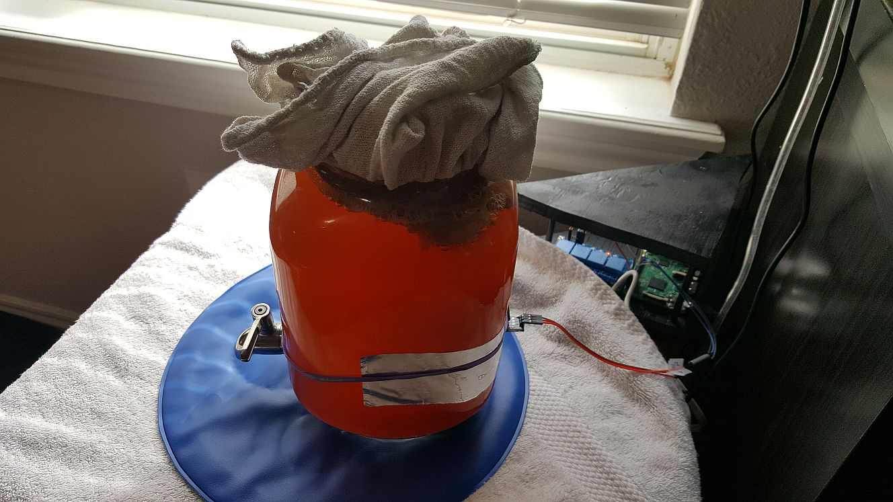
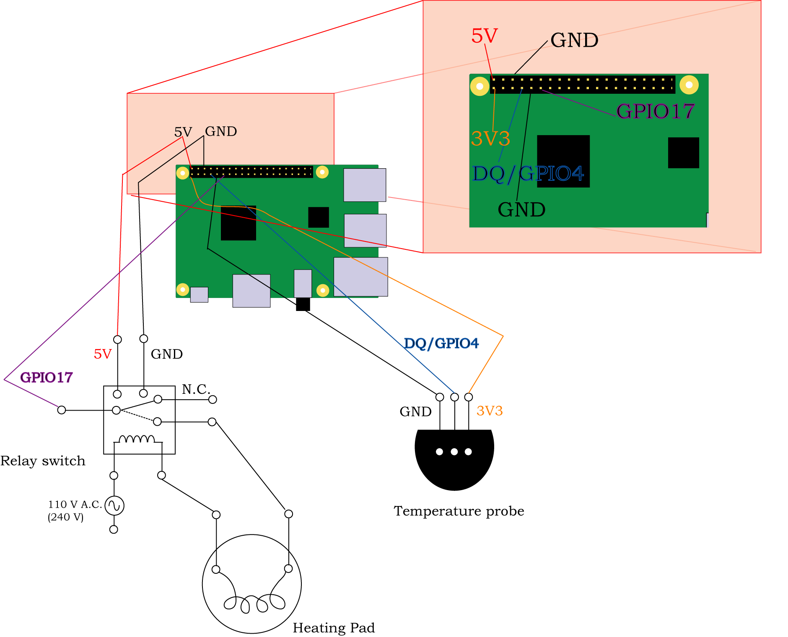

# AutoBooch
Description of my kombucha brewing system, automated using a Raspberry Pi

Tired of unpredictable brewing times for your kombucha? Worried about the health of your SCOBY pellicle? Look no further! The AutoBooch has your back!

For context of what a SCOBY is, and some recipes and tricks, you should visit the Instructable associated with this project:
https://www.instructables.com/id/AutoBooch-Automate-Your-Kombucha-Brewing-System-Wi/

## Setup

Refer to the Instructable for a full list of materials. This documentation assumes you have a Raspberry Pi set up with a Debian-like GNU/Linux operating, you have a way of interacting with a shell terminal, and that you have root ('administrator') privileges.
It also assumes you have set up a DS18B20 1-Wire temperature probe as per the instructions to GPIO4 and are also connected to a switch relay, with GPIO17, that controls a heating pad. The physical set-up should hopefully look something like this:

The wiring schematic should look something like this:

To give you a (perhaps) better picture of the wiring, this is what it might look like in prototype form:

Add the GPIO pins to your Device Tree by editing the file (as root) the /boot/config.txt file:

`sudo nano /boot/config.txt`

(If you like to use nano for editing). Add the following line (and save the changes (Ctrl-X)):

`dtoverlay=w1-gpio`  

Activate the w1 kernel modules to use w1 protocol: 
`sudo modprobe w1-gpio`
`sudo modprobe w1-therm`

Power off the Pi and connect the thermal probe. This involves selecting a GPIO pin to be the designated read-out. Here, we take GPIO4. The wiring schematic provided here refers to the Raspberry Pi 3B GPIO pin configuration; please make sure you check your model's pin configuration. You will also need 3.3 V (3V3) power and an Earth (GND). It's safer to connect the jumper leads to both the Pi and the temperature probe when the Pi is powered off. Restart the Pi.

Check your probe identifier prefix by looking at the directories created in the correct device directory:

`ls /sys/bus/w1/devices/`

This should display 'w1_bus_master1' and some gobbley-gook, which is the serial number (mine says ''28-04169314f7ff"). If the prefix for your device is '28,' then hooray! You don't need to change any code. Otherwise, note the first two digits of this code. We'll edit the script to use this later. The temperature is read out into a file called 'w1_slave' in the serial number directory.

## Set as a cron job

`crontab -e`

Given the heat capacity and expected temperature changes, sampling the temperature every half hour is easily adequate. So, set the cron job to: 

`*/30 * * * * /absolute_path_to_your_script/auto_booch.py`
